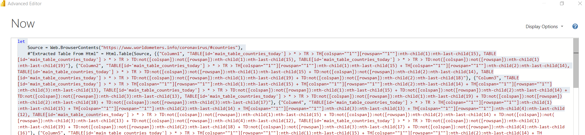
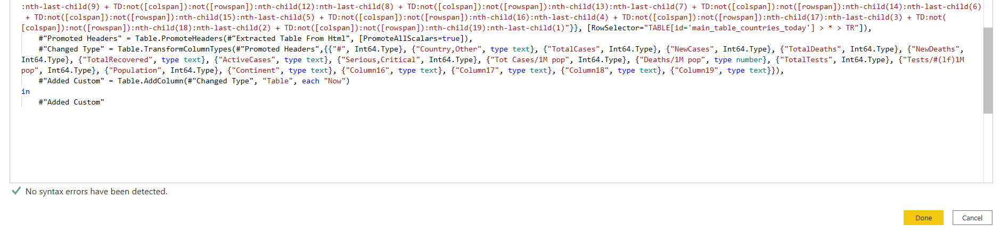

# Covid analysis with Power BI 
This repo was designed to show how to present information in the Power BI platform.
The data is colected direclty from the <a href="https://www.worldometers.info/coronavirus/"> WorldMeter</a> website about the covid-19 outbreak.

Trough the .pbix file it is possible to navigate, filter, and investigate the data by country, region, making it easy to understand the whole situation behind the data.

Lets take a look on a table by country. Some columns are built using the Dax language, like the % of cases and deaths over population.

      
Now, lets see the kpis ploted in maps, which is more visually friendly than a table.      

 
We also can analyze the correlation between cases and deaths by 1 million population

      
Finnaly we can take a look on how data is been architectured in the platform using Dax.

      

